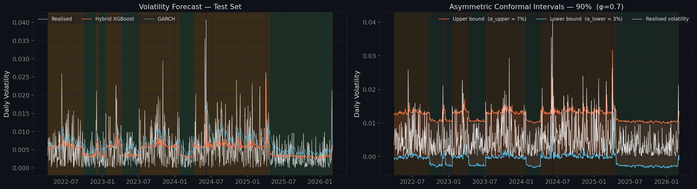
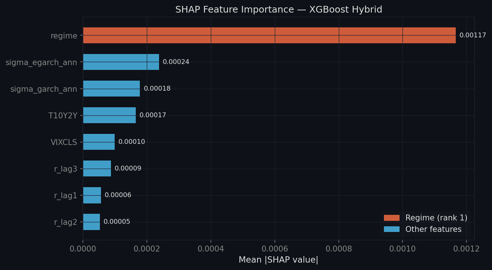
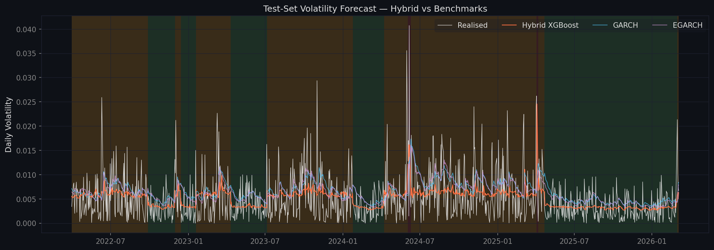
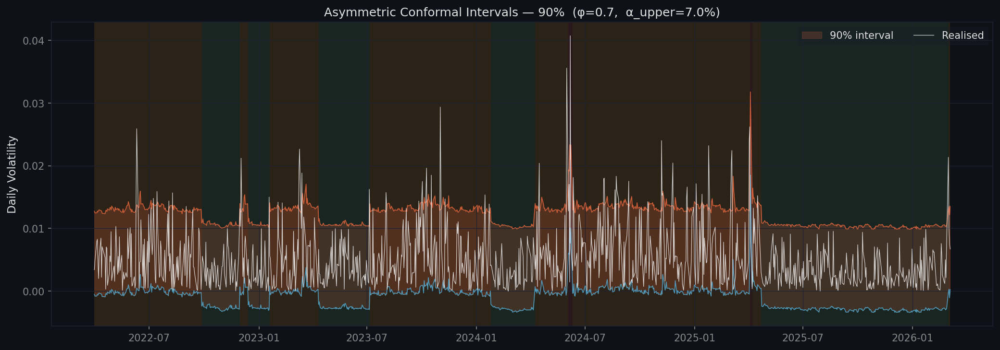
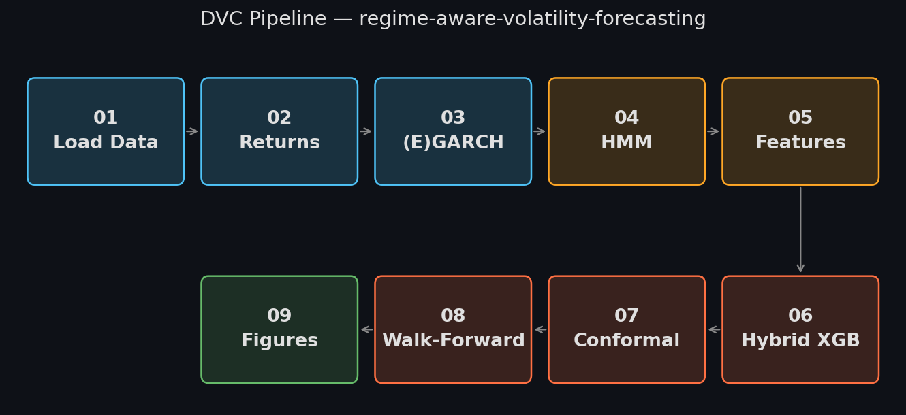

# Regime-Aware Volatility Forecasting — MXN/USD

**Luis Alejandro Rosas Martínez · PhD Applied Mathematics · Institut Polytechnique de Paris (IPP) · 2025**



---

## Why this project exists

Constant-volatility pricing frameworks such as Black-Scholes-Merton rely on assumptions about return distributions that are testable in time-series data. For the Mexican peso (MXN/USD), each of those assumptions can be evaluated formally — and each is overwhelmingly rejected on this sample.

This project was not built to predict volatility better than a benchmark. It was built to answer a precise question:

> *By how much do MXN/USD returns deviate from constant-volatility assumptions, and what is the gain from accounting for those deviations?*

Volatility is proxied by the next-day absolute return |r_{t+1}|, a standard observable measure in daily-frequency studies.

The answer is given in four steps — each a formal statistical result, not an assumption:

1. **Test normality** — Jarque-Bera statistic: 29,801.1 (p ≈ 0). Empirical excess kurtosis: **10.30**, more than ten times that of a normal distribution. Normality is overwhelmingly rejected on this sample.
2. **Test volatility clustering** — ARCH-LM statistic: 1,463.3 (p < 2.1 × 10⁻³⁰⁸). The null of no ARCH effects is rejected. Volatility persistence is a measured property of this series, not a stylized fact to be assumed.
3. **Fit and compare models** — GARCH(1,1)-t and EGARCH(1,1)-t. Model selection by BIC. The Student-t innovation distribution is chosen not merely because fat tails are a stylized fact — the moment-matching estimate ν̂ ≈ 4.6 is derived directly from the empirical kurtosis before any model is fitted.
4. **Build the hybrid forecast** — XGBoost trained on econometric outputs and macro features. The Diebold-Mariano test evaluates whether the improvement is statistically significant. SHAP values explain which features drive it.

**The key methodological discipline:** stylized facts provide prior motivation, but model inclusion is data-validated on this specific sample. Formal test rejection provides the primary justification for each modeling layer. The architecture is conditional on this asset, frequency, and sample period — and is falsifiable as a result.

---

## Mathematical foundation

### Why GARCH-t and not normal GARCH?

The GARCH(1,1) model specifies:

$$r_t = \mu + \epsilon_t, \quad \epsilon_t = \sigma_t z_t, \quad \sigma_t^2 = \omega + \alpha\epsilon_{t-1}^2 + \beta\sigma_{t-1}^2$$

The choice of Student-t innovations $z_t \sim t_\nu(0,1)$ is not arbitrary. The theoretical excess kurtosis of the Student-t is:

$$\text{Excess Kurtosis} = \frac{6}{\nu - 4}, \quad \nu > 4$$

Inverting this relation with the empirical excess kurtosis K = 10.30:

$$\hat{\nu}_{\text{moments}} = \frac{6}{K} + 4 = \frac{6}{10.30} + 4 \approx 4.6$$

This moment-matching estimate provides a principled starting point before maximum likelihood. Using normal innovations would materially understate tail probabilities on this series.

### Why EGARCH in addition to GARCH?

The EGARCH model captures asymmetric volatility response through the log-variance equation:

$$\log(\sigma_t^2) = \omega + \beta\log(\sigma_{t-1}^2) + \alpha(|z_{t-1}| - \mathbb{E}[|z_{t-1}|]) + \gamma z_{t-1}$$

For equity markets, γ < 0 (crashes amplify volatility more than rallies). For MXN/USD, the sign is an empirical question. The fitted model yields **γ̂ > 0** — peso appreciations generate marginally larger volatility increases than depreciations of equal magnitude. This is the opposite of the standard equity leverage effect and is an empirical finding specific to this currency pair.

### Why a 3-state HMM?

GARCH captures persistence but treats volatility as a single continuous process. The Hidden Markov Model estimates discrete latent regimes via the Baum-Welch algorithm:

$$\hat{\mathbf{Z}} = \arg\max_{\mathbf{Z}} P(\mathbf{Z} \mid \mathbf{r};\, \theta)$$

**K = 3 is not arbitrary.** Two states confound elevated-but-normal volatility (2008 pre-crisis, 2022 rate-hike period) with genuine crisis volatility. Four states over-segment given the sample size. BIC formally justifies K = 3.

The fitted HMM assigns the 2008 Lehman collapse, 2016 Trump election shock, and 2020 COVID crash to the high-volatility regime (< 3% of trading days) without supervision. The GARCH conditional volatility spikes show qualitative agreement with independently estimated HMM regime boundaries — a consistency check between two separately estimated models.

### Why not Markov-Switching GARCH?

The natural joint model is RS-GARCH, where GARCH parameters switch with the latent state. We adopt instead a **feature-augmented architecture** — GARCH, EGARCH, and HMM estimated independently and combined as XGBoost features. This is a deliberate trade-off: joint statistical efficiency is sacrificed for modularity, interpretability, and reproducibility. RS-GARCH is documented as a natural extension in the research roadmap.

### The hybrid model

$$\hat{\sigma}_{t+1}^{\text{hybrid}} = f_{\text{XGB}}\!\left(\hat{\sigma}_t^{\text{GARCH}},\; \hat{\sigma}_t^{\text{EGARCH}},\; z_t^{\text{HMM}},\; r_{t-1}, r_{t-2}, r_{t-3},\; \text{VIX}_t,\; \text{T10Y2Y}_t\right)$$

The hybrid model is not intended to replace econometric structure but to combine heterogeneous volatility signals within a flexible nonlinear forecasting layer. The econometric outputs remain interpretable inputs rather than being absorbed into a black box.

**SHAP values confirm the regime label is the dominant driver** (mean |SHAP| = 0.00117, 5× larger than the next feature), consistent with the hypothesis that regime-awareness is the primary source of the hybrid model's edge.



### Asymmetric conformal prediction intervals

Split conformal prediction provides distribution-free coverage guarantees. The standard symmetric predictor constructs equal-width bounds from absolute residuals. For volatility forecasting, underestimating upward spikes is more consequential than underestimating downward moves.

The **asymmetric conformal predictor** with φ = 0.7 splits the error budget α using signed residuals:

| Tail | Budget | Interpretation |
|------|--------|----------------|
| Lower | (1−φ)α = 0.3α | Wider tolerance for lower violations |
| Upper | φα = 0.7α | Upper bound absorbs 70% of budget — more conservative |

The correct null hypothesis for the Kupiec POF test is therefore not α but **α_upper = φ·α**: 14% for the 80% interval, 7% for the 90%, 3.5% for the 95%.

---

## Results

| Metric | Hybrid XGBoost | GARCH | EGARCH |
|--------|---------------|-------|--------|
| RMSE (test set) | **0.004462** | 0.004974 | 0.004859 |
| RMSE improvement | **+10.28% vs GARCH** | — | — |
| QLIKE | 1.6480 | 1.6380 | 1.6392 |
| WF RMSE (5-fold expanding) | **0.004291** | 0.004836 | 0.004726 |
| WF improvement | **+11.28% vs GARCH** | — | — |
| DM statistic vs GARCH | **−6.67** (p ≈ 0) | — | — |

**Conformal coverage (asymmetric, φ = 0.7):**

| Interval | Target | Empirical | Kupiec H₀ |
|----------|--------|-----------|-----------|
| 80% | 80.0% | 80.36% | Not rejected |
| 90% | 90.0% | 91.90% | Not rejected |
| 95% | 95.0% | 96.05% | Not rejected |

The DM test rejects equal predictive accuracy under RMSE loss against both benchmarks. The walk-forward result confirms the gain is not specific to a single test window.





---

## Pipeline



A fully reproducible 9-stage DVC pipeline. Changing `params.yaml` propagates automatically through all downstream stages via `dvc repro`.

---

## Quickstart

```bash
git clone https://github.com/alex-rosas/regime-aware-volatility-forecasting
cd regime-aware-volatility-forecasting
conda create -n vol python=3.11 && conda activate vol
pip install -r requirements.txt
dvc repro
streamlit run app/streamlit_app.py
```

**DVC remote:** DagsHub — artifacts tracked, experiments versioned.

---

## Repository structure

```
src/
  pipeline.py        — step_* functions for all 9 stages
  dark_viz.py        — shared dark-mode matplotlib style
  models/
    garch.py         — GARCH/EGARCH wrapper (arch library)
    hmm.py           — 3-state HMM (hmmlearn)
    hybrid.py        — XGBoost hybrid + SHAP interface
    conformal.py     — ConformalPredictor + AsymmetricConformalPredictor
stages/
  01_load_data.py … 09_build_figures.py   — thin DVC wrappers
notebooks/
  01–09              — exploratory analysis and pedagogy
app/
  streamlit_app.py   — Overview + metrics dashboard
  pages/             — Volatility & Regimes · Forecast · Backtesting
params.yaml          — single source of truth for all hyperparameters
dvc.yaml             — pipeline DAG
metrics.json         — tracked metrics (git + DagsHub experiments)
```

---

## References

**Volatility modelling**

Engle, R. F. (1982). Autoregressive Conditional Heteroskedasticity with Estimates of the Variance of United Kingdom Inflation. *Econometrica*, 50(4), 987–1007.

Bollerslev, T. (1986). Generalized Autoregressive Conditional Heteroskedasticity. *Journal of Econometrics*, 31(3), 307–327.

Nelson, D. B. (1991). Conditional Heteroskedasticity in Asset Returns: A New Approach. *Econometrica*, 59(2), 347–370.

Baillie, R. T., & Bollerslev, T. (1989). The Message in Daily Exchange Rates: A Conditional-Variance Tale. *Journal of Business & Economic Statistics*, 7(3), 297–305.

Cont, R. (2001). Empirical Properties of Asset Returns: Stylized Facts and Statistical Issues. *Quantitative Finance*, 1(2), 223–236.

Tsay, R. S. (2010). *Analysis of Financial Time Series* (3rd ed.). Wiley.

**Regime modelling**

Rabiner, L. R. (1989). A Tutorial on Hidden Markov Models and Selected Applications in Speech Recognition. *Proceedings of the IEEE*, 77(2), 257–286.

Baum, L. E., Petrie, T., Soules, G., & Weiss, N. (1970). A Maximization Technique Occurring in the Statistical Analysis of Probabilistic Functions of Markov Chains. *Annals of Mathematical Statistics*, 41(1), 164–171.

Viterbi, A. J. (1967). Error Bounds for Convolutional Codes and an Asymptotically Optimum Decoding Algorithm. *IEEE Transactions on Information Theory*, 13(2), 260–269.

**Forecast evaluation**

Diebold, F. X., & Mariano, R. S. (1995). Comparing Predictive Accuracy. *Journal of Business & Economic Statistics*, 13(3), 253–263.

Kupiec, P. H. (1995). Techniques for Verifying the Accuracy of Risk Measurement Models. *Journal of Derivatives*, 3(2), 73–84.

**Conformal prediction**

Angelopoulos, A. N., & Bates, S. (2023). Conformal Prediction: A Gentle Introduction. *Foundations and Trends in Machine Learning*, 16(4), 494–591.

---

*PhD Applied Mathematics · Institut Polytechnique de Paris (IPP) · 2025*
